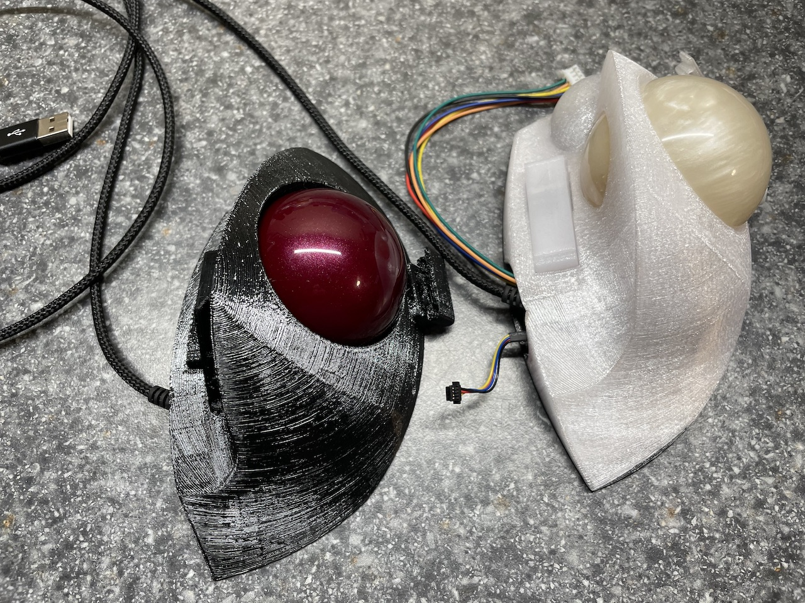

This is the code to run a trackball I'm building for myself. 

It's currently based around either a [Seeeduino XIAO](https://wiki.seeedstudio.com/Seeeduino-XIAO/) or the very similar [Adafruit QT Py](https://www.adafruit.com/product/4600), and a couple of optical mouse sensor breakout boards. I've built two so far, one using [these ADNS-9800 boards](https://www.tindie.com/products/jkicklighter/adns-9800-optical-laser-sensor/), and one using [these PMW3360 breakout boards](https://www.tindie.com/products/jkicklighter/pmw3360-motion-sensor/).

### Update January 2025 ###
As an alternative to off-the-shelf microcontrollers and sensor boards, I've created a custom main board and sensor breakouts that can be ordered from a PCB creation/assembly service (I've been using [JLCPCB](https://jlcpcb.com)). The KiCad files and the files need to order them from JLCPCB are in their own repositories on github. 

[Details on the custom boards are here.](hardware/Custom.md)

### Update January 2026 ###
I added an [updated version of the button carrier](hardware/Button-carrier-v2.md). Its design is a bit more refined overall, but the main feature is that it allows you to avoid soldering wires to the microswitch by accepting a 3-pin JST XH female connector.

I also added an option to modify the sensor transform for a left-handed build. To make use of this, print mirrored versions of the main body and bottom plate (most slicers have an option to do this at slicing time), and define LEFT_HANDED when compiling trackball.cpp to modify the sensor transform. The `env:rp2040_mwtrackball_left_handed` section in [platformio.ini](platformio.ini) demonstrates this.

 

## History ##

I started this project because my favorite ergonomic trackball, the Trackman Marble FX, is basically no longer viable. I really like the shape of it, but it's PS/2 only, has a number of issues with tracking and durability, and has become really hard to find/expensive. I have a small collection of them, most of which have broken over the years. 

I decided to build my own trackball with a shape that fits my hand similar to the old Trackman Marble FX, and incorporated a feature from the Kensington Slimblade (probably my second favorite, although not for its ergonomics): twisting the ball in the Z axis acts like a scroll-wheel (complete with clicky sounds produced by a piezo speaker). 

[Short video demo is here](https://www.youtube.com/watch?v=PVdwrbiuzwA)

To be able to sense rotation in all three axes, it needs to use two mouse sensors, positioned at different points around the ball.  

I'm quite happy with the current state of the project. I prefer using this trackball to any other I've used at this point, which is saying something. :)  

The [hardware](hardware) directory contains the OpenSCAD files for the printed plastics. The [src](src) directory has the code. If you want to see how all the parts fit together, you can go straight to the [assembly guide](hardware/Assembly.md).  

## BUILD ##

I'm building this with PlatformIO/VSCode. The root of the repository should open directly with VSCode.

I do my work on Mac OS X, so I don't know if there will be any issues using it on Windows or Linux.

