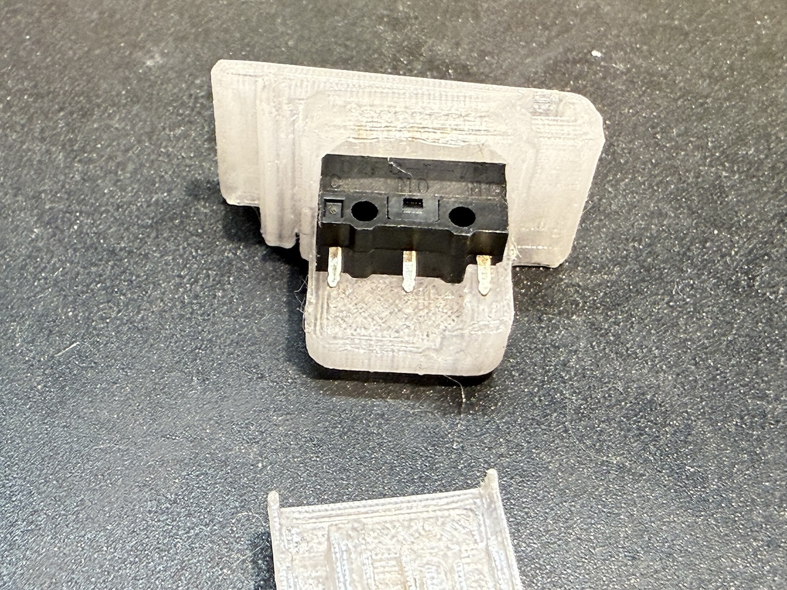
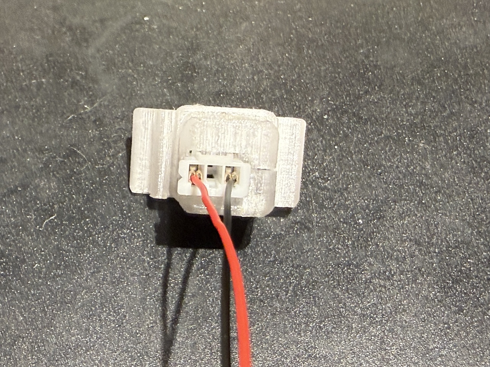

The updated button carrier prints in two pieces -- the main body, and a cap that holds the microswitch in place.

To use this version, print the `microswitch-v2` stl files instead of the older `microswitch-cherry` ones, insert the microswitch as shown (making sure the switch is oriented with the switch under the projection from the top piece), and snap the cap side in. It should hold the switch tightly when inserted into the square hole in the trackball body.

Insted of soldering wires to the switch, the wiring connection can now be made by inserting a female JST-XH 1.25mm-pitch connector into the back of the carrier. Pins 1 and 3 of the connector will line up with the common and normally-open pins on the microswitch, and the pins on the switch should be close enough to the JST_XH pin profile to make good contact.

