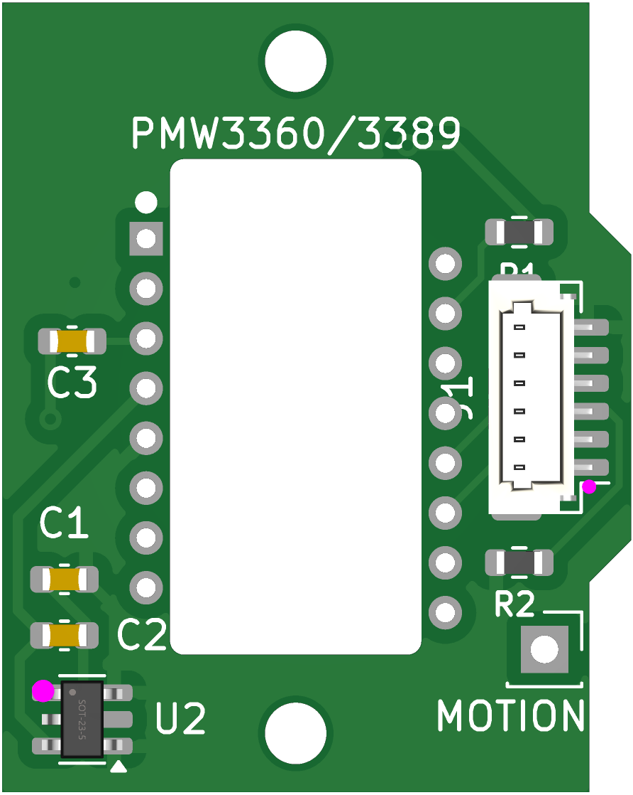
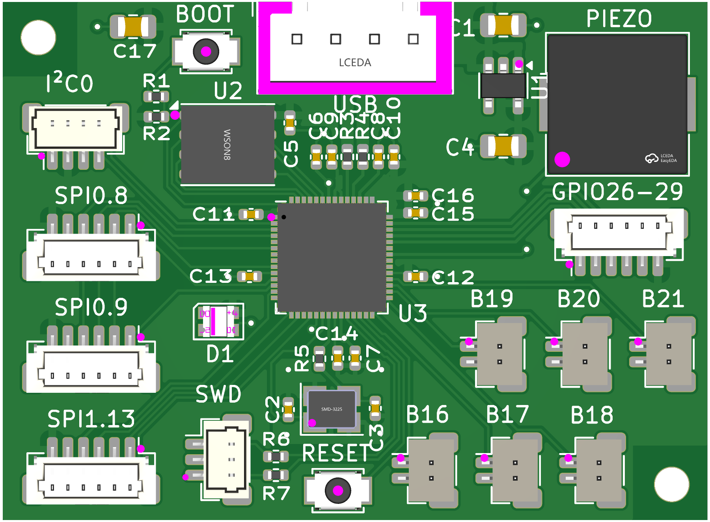
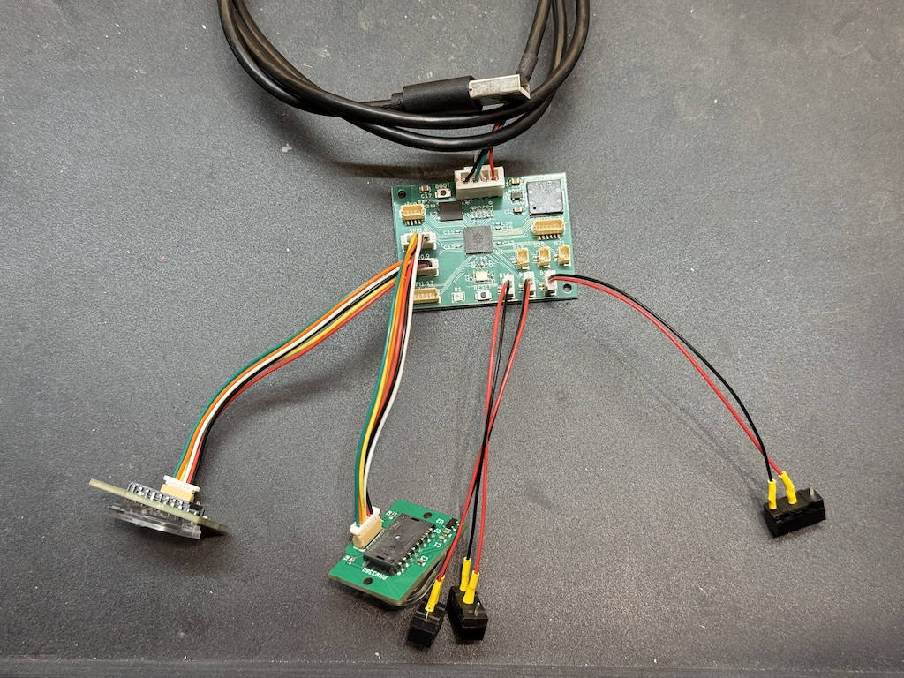
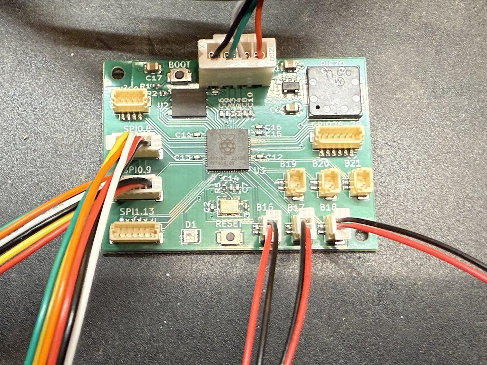
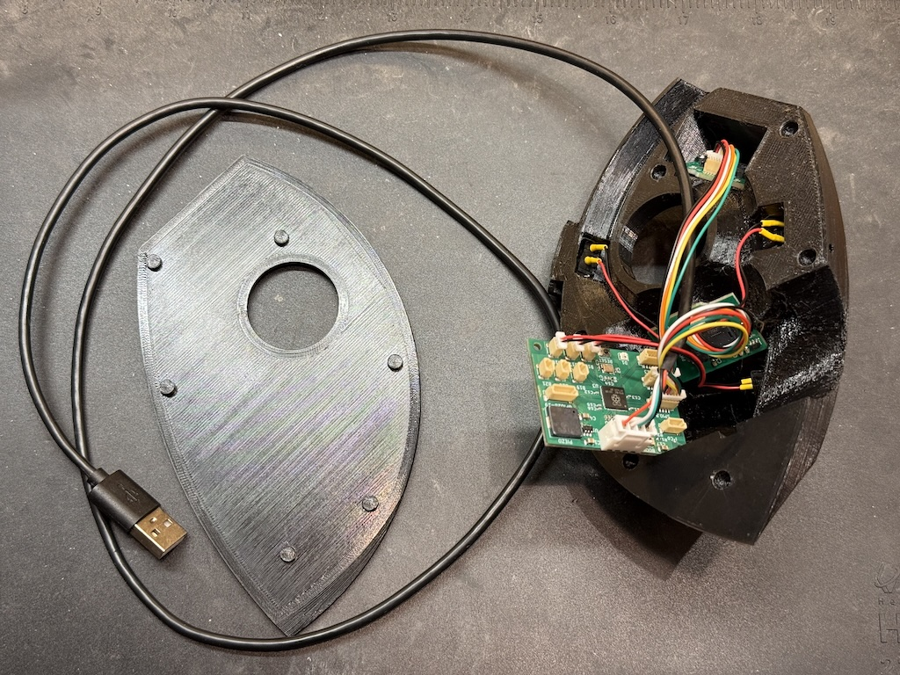

# Custom boards #

I recently designed a custom sensor board and main board for use with this trackball design. The primary motivations behind this were:
- more reliable and permanent builds than the original breadboard method
- easier assembly (allowing the use of off-the-shelf cables for the sensors instead of soldering my own)

To this end, both the sensors and the main board use very compact JST-SH 1.0mm pitch connectors (6 pin for the SPI sensors and 2 pin for the buttons). The pinout for the SPI connections on both the mainboard and the sensors is taken from [Pmod Type 2](https://en.wikipedia.org/wiki/Pmod_Interface).

## Sensor breakout ##

My custom sensor board is in [this github repository](https://github.com/monroewilliams/pmw3360-breakout).

It's derived from [jfedor2](https://github.com/jfedor2)'s [PMW3360 breakout board](https://github.com/jfedor2/pmw3360-breakout) project, modified to use a footprint very similar to the PMW3360 breakout boards I sourced from sellers on Tindie, and with a surface mount JST-SH 6 pin connector instead of 2.54mm pitch through-hole pads.

As with his project, there are no level shifters on this board, so it must be used with 3.3v logic. 

The assembly service doesn't seem to be able to place the actual sensor, so I source those separately and hand-solder them (they're through-hole at around 1.75mm pitch, so not too difficult). It's easy to find PMW3360 and PMW3389 sensors on AliExpress. They can be had for under $10USD each, just make sure you order ones that have the "LM19-LSI" lens included, like [this one](https://www.aliexpress.us/item/3256807282468640.html).

## Main board ##

The main board is in [this github repository](https://github.com/monroewilliams/rp2040_mwtrackball).

It uses an RP2040 processor, and is derived from the sample [minimal reference design](https://datasheets.raspberrypi.com/rp2040/Minimal-KiCAD.zip) provided by Raspberry Pi.

Features include:
- 2 JST-SH 6 pin connectors connected to SPI0, with distinct chip-select lines
- 1 JST-SH 6 pin connector connected to SPI1, with its own chip-select line
- 6 JST-SH 2 pin connectors each connected to a GPIO (16 through 21) and ground, for easy connection to button switches
- 1 JST-SH 4 pin connector connected to I2C-capable pins, and compatible with Qt-STEMMA plugs
- 1 JST-SH 3 pin connector following the [Raspberry Pi 3-pin Debug Connector Specification](https://datasheets.raspberrypi.com/debug/debug-connector-specification.pdf)
- 1 JST-SH 6 pin connector breaking out some of the remaining GPIOs (26 through 29), as well as +3.3v and ground
- USB broken out on a 4 pin JST-XH header.
- an on-board surface mount piezo speaker
- a NeoPixel LED (because why not?)

For the basic trackball design, all that's needed is two of the SPI connections and 3 buttons (give or take), but if I was going to the trouble of designing a board I wanted to give it a bit of room to grow. 

The overall dimensions of the board (46mm x 34mm) are approximately the same as those of the mini-breadboard I used in the original project. This means it will fit in the existing plastics design without any modifications. (Although if you're replacing the electronics in an existing build like I did, the new sensor boards may need a bit more clearance. A hand file is your friend here.)

This repository has a variants directory containing a [pins_arduino.h](../variants/rp2040_mwtrackball/pins_arduino.h) describing the board, and there's an `[env:rp2040_mwtrackball]` section in the [platformio.ini](../platformio.ini) showing how to use it. This is the configuration I'm currently using for my own trackball, so I can say with some confidence that it works.

## Cables, etc. ##

I was able to source all the cables I needed for assembly pretty cheaply from AliExpress. 

Both types of JST-SH cables I used are from [here](https://www.aliexpress.us/item/3256807031812901.html) 
- "6P, 100mm, Reverse" for the SPI cables
- "2P, 100mm, Single head" for the pigtail cables to connect the button switches (I just hand-soldered these to the switch contacts)

The USB cable [here](https://www.aliexpress.us/item/3256806154142780.html) ("XH2.54-4P 1M") has the correct pinout to plug directly into the JST-XH USB header.

## Assembled ##

These are pictures of a board from the second prototype run, before I added the SWD plug. The first batch of "version 1.0" boards is in production as I write this.

