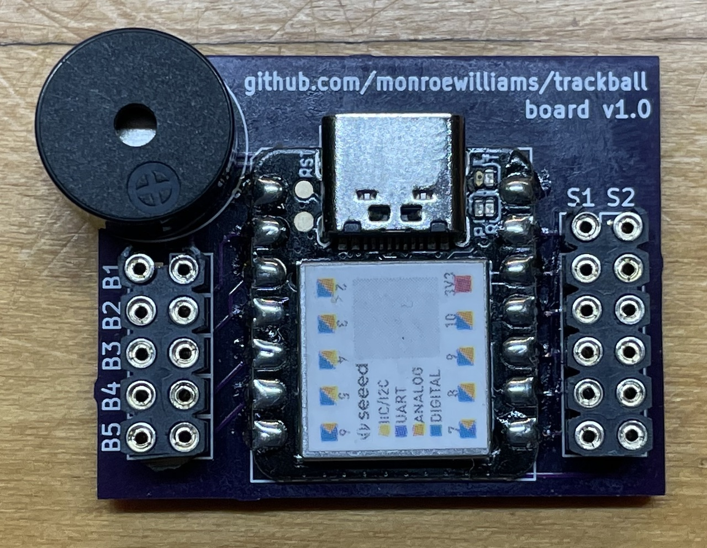

# Board

This directory contains the [Kicad](https://kicad.org) files for a circuit board I've designed for the trackball. This is intended to take the place of the breadboard in a more permanent build. 

 

This design uses the [Seeeduino XIAO Kicad library](https://www.seeedstudio.com/blog/2020/04/23/use-seeeduino-xiao-in-kicad-pcb-design-like-a-components/), so if you want to open/modify it with Kicad you probably need to install that first. 

This is my first attempt at designing something with Kicad, and I really have no idea what I'm doing. I've had an initial batch of them made by [OshPark](https://oshpark.com), but I haven't actually tested them out yet, so caveat emptor, etc, etc. 

I also haven't yet modified the OpenSCAD files for the trackball body to have an option that will make these fit properly. I'm working on that as time allows. 

That being said, if you want some of these made for yourself, you can order them 3 at a time [here](https://oshpark.com/shared_projects/D077qVES). 
